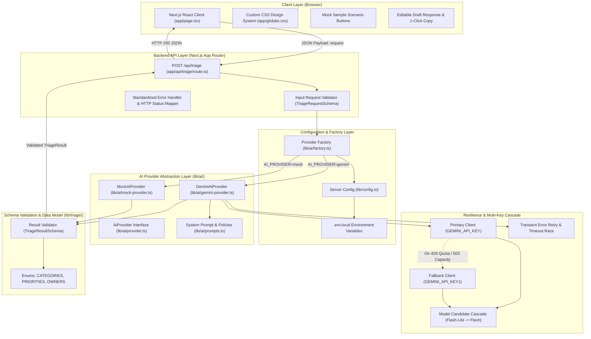
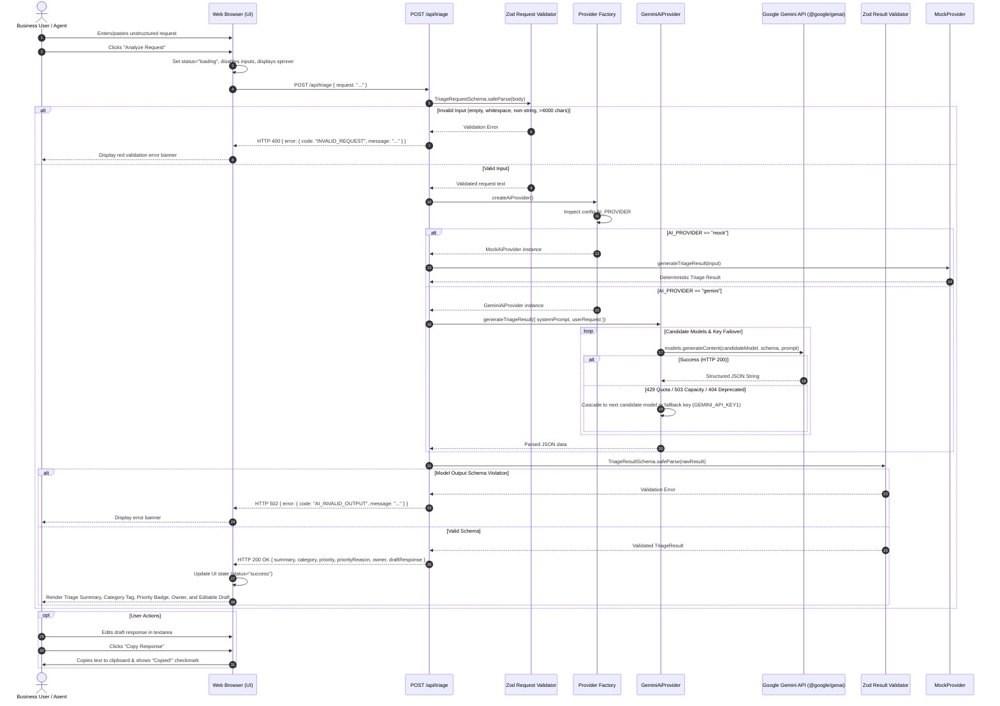
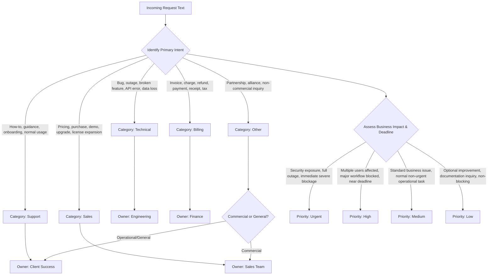

# AI Request Triage Assistant — Architecture & Workflow Specification

This document provides a comprehensive technical architecture and end-to-end operational workflow breakdown for the **AI Request Triage Assistant**.

---

## 1. System Architecture Overview

The system follows a clean, layered architecture separating the **Presentation Layer (UI)**, **API Route Handler**, **Configuration & Provider Factory**, **AI Provider Engine**, and **Schema Validation Layer**.



---

## 2. End-to-End Operational Workflow

The following sequence diagram details the lifecycle of an incoming business request from user entry to the rendered triage cards and editable draft response:



---

## 3. Detailed Component Breakdown

### 3.1 Presentation Layer (`app/`)

- **`app/page.tsx`**: Single-page application managing reactive states:
  - `status`: `'idle' | 'loading' | 'success' | 'error'`
  - `requestText`: Raw input string with live character counter.
  - `result`: Holds the validated `TriageResult` object.
  - `draftResponse`: Editable response state detached from raw result.
  - `errorMessage`: Sanitized user-facing error message.
  - `copied`: Feedback state for the 1-click clipboard button.
- **`app/globals.css`**: Design tokens adhering to modern dark mode standards:
  - Surface elevation: Background `#0b0f17`, Surface `#111827`, Card `#1a2234`, Border `#2d3748`.
  - Color-coded priority badges:
    - `Urgent`: Red `#ef4444` background with `#dc2626` border.
    - `High`: Amber/Orange `#f59e0b`.
    - `Medium`: Blue `#3b82f6`.
    - `Low`: Slate `#64748b`.
  - Responsive down to 320px mobile viewports.

### 3.2 Route Handler Layer (`app/api/triage/route.ts`)

- Implements strict input parsing before triggering backend resources.
- Centralized HTTP status code mapping:| Error Code                 | HTTP Status   | Meaning                                          |
  | :------------------------- | :------------ | :----------------------------------------------- |
  | `INVALID_REQUEST`        | **400** | Malformed JSON, empty request, or schema failure |
  | `OUT_OF_SCOPE`           | **422** | Non-business requests                            |
  | `AI_RATE_LIMITED`        | **429** | API quota or rate limit exceeded                 |
  | `AI_INVALID_OUTPUT`      | **502** | Model response failed schema parsing             |
  | `AI_SERVICE_UNAVAILABLE` | **503** | Upstream model at capacity or overloaded         |
  | `AI_TIMEOUT`             | **504** | Execution exceeded configured timeout limit      |
  | `INTERNAL_ERROR`         | **500** | Unexpected runtime exception                     |

### 3.3 Configuration & Provider Factory (`lib/config.ts` & `lib/ai/factory.ts`)

- **`getServerConfig()`**: Validates server environment variables using Zod:
  - `AI_PROVIDER`: `'mock' | 'gemini'` (default: `'mock'`).
  - `AI_MODEL`: Primary model (e.g. `'gemini-3.5-flash-lite'`).
  - `GEMINI_API_KEY`: Primary Google API key.
  - `GEMINI_API_KEY1`: Optional fallback Google API key.
  - `AI_TIMEOUT_MS`: Request timeout in ms (default: `45000`).
  - `AI_MAX_RETRIES`: Number of transient retries (default: `1`).
- **`createAiProvider()`**: Returns the selected provider conforming to the `AiProvider` interface without exposing vendor-specific details to the API route.

### 3.4 AI Provider Engine (`lib/ai/`)

- **`AiProvider` Interface (`lib/ai/provider.ts`)**:
  ```typescript
  export interface AiProvider {
    readonly name: string;
    generateTriageResult(input: AiProviderInput): Promise<unknown>;
  }
  ```
- **`GeminiAiProvider` (`lib/ai/gemini-provider.ts`)**:
  - Uses `@google/genai` with structured JSON output enforcement (`responseSchema`).
  - **Multi-Key Fallback**: Stores both primary client and fallback client. If the primary key hits quota (`429`), it transparently switches to the fallback key pool.
  - **Candidate Model Cascade**: Gracefully cascades through active models:
    `[config.AI_MODEL, 'gemini-3.5-flash-lite', 'gemini-flash-lite-latest', 'gemini-3.1-flash-lite', 'gemini-3-flash-preview', 'gemini-3.5-flash']`.
  - **Transient Error Retry**: Automatically retries `503`, network disconnects (`ECONNRESET`), and timeouts.
- **`MockAiProvider` (`lib/ai/mock-provider.ts`)**:
  - Offline-first deterministic rule engine covering the 6 primary business challenge scenarios and edge cases with zero latency and no external network dependencies.

### 3.5 Schema & Data Contracts (`lib/triage/`)

- **`CATEGORIES`**: `['Sales', 'Support', 'Billing', 'Technical', 'Other']`
- **`PRIORITIES`**: `['Low', 'Medium', 'High', 'Urgent']`
- **`OWNERS`**: `['Sales Team', 'Client Success', 'Finance', 'Engineering']`
- **`TriageResultSchema`**: Validates that all six output fields exist, are non-empty strings, and conform strictly to the allowed enums.

---

## 4. Operational Classification & Routing Rules

The system prompt enforces the following business logic:

---

## 5. Security & Boundary Architecture

1. **Server-Side Secret Isolation**:
   - `GEMINI_API_KEY` and `GEMINI_API_KEY1` are strictly server-side variables.
   - None of the keys are prefixed with `NEXT_PUBLIC_*`, ensuring they are never bundled into client JavaScript.
2. **No Unchecked Free-Form Prompts**:
   - The user cannot supply system instructions; the system prompt is hardcoded and controlled on the server.
3. **No External Autonomous Actions**:
   - The system strictly outputs a draft for human review. It does not automatically send emails, trigger webhooks, update production
   - databases, or mutate ticket systems.
4. **Resilient Offline Mode**:
   - Setting `AI_PROVIDER=mock` allows 100% of the system to run locally during internet drops or API outages.


